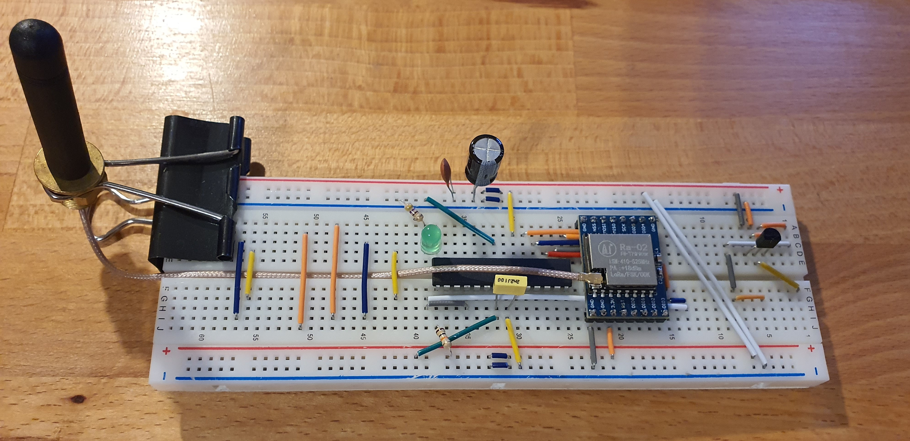

# AVR_LoRa
Minimal LoRa SX1278 Ra-02 library written in C for AVR

This library was writter for beginners in AVR world.

In default, module is in continuous receive mode. In the end of any data transfer, module go back to receive mode.
You may add Your own uart library if needed, or just remove it from program.

Note: WSL - Windows Subsystem for Linux can run windows app, so in Makefile I'm using avrdude.exe to upload code to uC, but compile on linux. 

I highly encourage to build ur own antenna. Its much less expensive, offers good range and it is fun to build! 
https://m0ukd.com/calculators/quarter-wave-ground-plane-antenna-calculator/

Based on arduino version: https://github.com/sandeepmistry/arduino-LoRa

